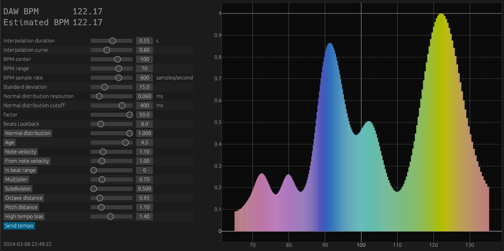

# Midi BPM detection

The purpose of this project is to let you play a midi instrument without worrying about being on time when recording,
instead, the tempo at which you play is evaluated in real time and injected into the host DAW ; doing so, hopefully,
your
recording will nicely fit into a loop without needing adjustments.

The plugin does so by comparing all combinations of intervals between notes and finding regularities, accounting for a
range of tempo configured by the user, a margin of error and other configurable parameters.

The screenshot below shows the different parameters and the realtime representation of the evaluation. The highest curve
will be the most probable BPM.

<a href="https://valsteen.github.io/midi_bpm_detection/"></a>

The process is indeed not perfect and parameters must be tweaked depending on the play style.

WASM Demo: https://valsteen.github.io/midi_bpm_detection/

## State of the project

This is in a very early works-on-my-machine state and will require further cleanup and testing.

In the meantime curious developers may simply have a look at the model, the core of the BPM evaluation can be found in
[midi/bpm_detection.rs](crates/midi/src/bpm_detection.rs).

## Building and using the Clap/VST3 Plugin

This has not been thoroughly tested and only on Mac.

The process should be:

```shell
cargo xtask bundle midi-bpm-detector-plugin --release
```

The plugin in two formats should be available under `target/bundled` , as `midi-bpm-detector-plugin.clap` and
`midi-bpm-detector-plugin.vst3`.

To make it really useful, it has to control the tempo of the host DAW. Plugins don't have this capability so there is
the companion controller script for Bitwig:

https://github.com/valsteen/bitwig-beat-detection-controller

Just make sure to load the controller script, then add the Clap plugin to the track on which you'll do your midi
recording.
Upon selecting the plugin, the controller script will detect it and start communicating with it ( the "DAW Port"
parameter will change, they will communicate via TCP from there ).
Then set the "Send tempo" to "On".