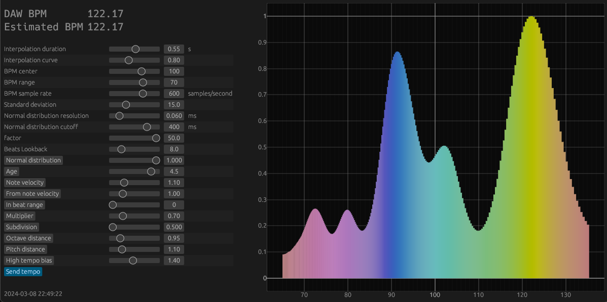

# MIDI BPM Detection

MIDI BPM Detection estimates tempo from incoming MIDI note-on events while you play. The goal is to let a musician record
freely, infer the tempo from the performance in realtime, and feed that tempo back to the host DAW so the recording can
fit a loop with less manual adjustment.

The detector compares intervals between recent notes, scores likely beat durations, and exposes both a single estimated
BPM and a histogram that shows competing tempo candidates. The histogram is important: it makes the guess inspectable
instead of hiding the model behind one number.

The screenshot below shows the plugin/demo UI with detection parameters and the realtime histogram. The strongest peak is
the current most likely BPM.

<a href="https://valsteen.github.io/midi_bpm_detection/"></a>

Try the browser demo: https://valsteen.github.io/midi_bpm_detection/

## What This Repository Contains

This is an experimental BPM detection monorepo. The Rust side contains three runtime modes:

- `plugin`: the CLAP/VST3 target intended to run inside a DAW. This is the production constraint.
- `desktop`: a native GUI app used for local iteration and native MIDI experiments.
- `wasm`: a browser demo that makes the detector easy to try and share.

The Kotlin side contains the companion Bitwig controller extension used by the production Bitwig tempo-control path.
The extension creates the Bitwig remote connection, writes its port into the selected plugin's `DAW Port` parameter, and
applies incoming BPM updates to Bitwig's transport tempo.

The project is still a work in progress. Tempo detection depends on play style and parameter tuning, and the host tempo
feedback path is currently shaped around Bitwig integration.

The core BPM evaluation lives in the Rust BPM core crate; see
[Rust workspace architecture](rust/architecture.md) for the crate layout.

## Quick Start

The full Bitwig tempo-control path needs both build roots:

- the Rust CLAP/VST3 plugin, built from `rust/`;
- the Kotlin Bitwig controller extension, built from `extension/`.

### Prerequisites

- Rust via [rustup](https://rustup.rs/).
- The stable Rust toolchain selected by [rust/rust-toolchain.toml](rust/rust-toolchain.toml).
- Nightly `rustfmt`, because [rust/rustfmt.toml](rust/rustfmt.toml) uses nightly-only formatting options.
- A JDK available to run Gradle. The extension build targets JVM 17, and Gradle can auto-provision that toolchain.
- Bitwig Studio.

Install the Rust components:

```shell
cd rust
rustup component add clippy rustfmt rust-src
rustup toolchain install nightly --component rustfmt
```

Check the Rust toolchain:

```shell
./scripts/dev.sh doctor
```

Check the Gradle and Java setup from the Kotlin build root:

```shell
cd ../extension
./gradlew --version
./gradlew javaToolchains
```

### Build The Plugin

```shell
cd rust
cargo xtask bundle midi-bpm-detector-plugin --release
```

The plugin bundles are written under:

```text
rust/target/bundled/
```

The release bundle command currently creates:

```text
rust/target/bundled/midi-bpm-detector-plugin.clap
rust/target/bundled/midi-bpm-detector-plugin.vst3
```

### Build The Bitwig Extension

```shell
cd extension
./gradlew packageBitwigExtension
```

The Bitwig extension package is written to:

```text
extension/extensions/beat-detection-controller/build/bitwig-extension/BeatDetectionExtension.bwextension
```

To copy it into the default Bitwig extensions folder for your user account:

```shell
./gradlew installBitwigExtension
```

The install task defaults to:

```text
${HOME}/Documents/Bitwig Studio/Extensions
```

You can override the install location with `-PbitwigExtensionsDir=...`, `BITWIG_EXTENSIONS_DIR`, or an ignored local
`extension/gradle-local.properties` file. See [development commands](docs/development.md) for details.

### Install In Bitwig

Bitwig scans plug-ins from the folders configured in `Dashboard > Settings > Locations > Plug-in Locations`. Copy or
symlink the bundled CLAP/VST3 plug-in into one of those folders, or add the bundle folder to Bitwig's plug-in locations,
then let Bitwig rescan. Bitwig's user guide documents the Dashboard settings and plug-in locations in
[The Dashboard](https://www.bitwig.com/userguide/latest/the_dashboard/) and plug-in behavior in
[Plug-in Handling and Options](https://www.bitwig.com/userguide/latest/vst_plug-in_handling_and_options/).

Install the `.bwextension` package with `./gradlew installBitwigExtension` or copy it into Bitwig's user extensions
folder. In Bitwig, add the controller extension from `Dashboard > Settings > Controllers > Add`; it appears as the
`Beat Detection Bitwig Extension` from `Midi BPM Detection`. Bitwig's user guide covers controller setup in
[MIDI Controllers](https://www.bitwig.com/userguide/latest/midi_controllers/). Bitwig Studio includes the local
controller API guide and reference under `Help > Documentation > Developer Resources`. Bitwig also publishes official
controller-extension examples at [bitwig/bitwig-extensions](https://github.com/bitwig/bitwig-extensions).

### Use In Bitwig

1. Load the Bitwig controller extension.
2. Add the BPM detector plug-in to a track that receives MIDI notes.
3. Select the plug-in device in Bitwig.
4. Enable the plug-in's `Send tempo` parameter.

The extension follows the currently selected device. When it recognizes this plug-in, it writes a localhost port into
the plug-in's `DAW Port` parameter. The plug-in then sends detected BPM updates over that socket, and the extension
applies them to Bitwig's transport tempo.

This Bitwig tempo-control path has been manually tested on macOS with Bitwig Studio 6.0.6.

## Documentation

- [Architecture](docs/architecture.md): cross-build-root overview, runtime modes, and architecture boundaries.
- [Rust workspace architecture](rust/architecture.md): Rust crate map, crate groups, and Rust runtime constraints.
- [Runtime lifecycle](docs/runtime-lifecycle.md): bootstrap wiring and data flows between plugin, desktop, WASM, GUI, and
  BPM detection components.
- [Plugin flow](docs/plugin-flow.md): host buffer processing, realtime handoff, background work, and tempo feedback.
- [Bitwig tempo bridge](docs/bitwig-tempo-bridge.md): the narrow plugin-to-controller-extension contract used to set
  Bitwig tempo, including the selected-device parameter rendezvous.
- [Native MIDI flow](docs/native-midi-flow.md): desktop MIDI service, controller boundary, worker messages, and native
  MIDI output ownership.
- [Algorithm archaeology](docs/algorithm-archaeology.md): the original tempo-detection idea and why the histogram exists.
- [Development commands](docs/development.md): setup, formatting, checking, plugin bundling, and WASM demo commands.
