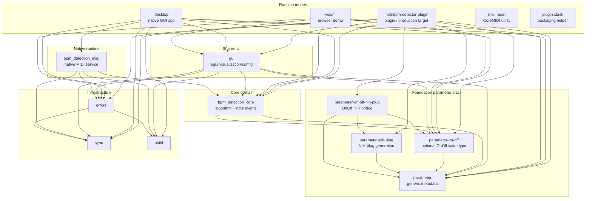

# Architecture

This document is a high-level map of the project. It should help contributors understand the main boundaries before
following the detailed runtime data flows.

## Purpose

The project estimates the tempo of incoming MIDI notes in realtime. The core algorithm compares intervals between recent
notes, scores likely beat durations, and exposes the most likely BPM plus histogram data for visualization.

The repository has two build roots:

- `rust`: the Cargo workspace for the BPM detector core, plugin, desktop app, WASM demo, and Rust tools.
- `extension`: the Gradle workspace for the Bitwig controller extension that lets the plugin control Bitwig tempo.

The same BPM detection model is used in three Rust operating modes:

- `plugin`: a CLAP/VST3 plugin intended to run inside a DAW. This is the production target.
- `desktop`: a native GUI development app.
- `wasm`: a browser demo using the shared egui UI.

The main architectural goal is to keep these modes from importing unnecessary dependencies from each other. Each mode
owns its host/runtime integration, while shared crates carry the algorithm, configuration shapes, reusable GUI, and small
cross-platform abstractions.

The production Bitwig tempo-control path spans both build roots: the Rust plugin estimates BPM and sends tempo updates
over a localhost bridge, while the Kotlin Bitwig controller extension owns the Bitwig transport-tempo write.

## Terminology

- Note-on event: the core input observation used for BPM detection. It includes timestamp, MIDI channel, pitch, and
  velocity. It is more precise than "note", which can also mean only pitch.
- Timed MIDI message: a runtime MIDI message with a timestamp, kept in native/host-facing crates for display, parsing,
  and protocol handling.
- BPM worker command: a message sent to a background BPM worker. It is already filtered to something the worker can act on,
  such as a note-on event, config change, or transport command.
- MIDI output command: a side effect owned by the native MIDI output thread, such as play, stop, or tempo feedback.
- Static BPM config: settings that reshape the detection model and require buffer/precomputed-data updates.
- Dynamic BPM config: scoring weights and lookback values that can be applied without rebuilding the detection model.

## Crate Map

The graph below shows direct workspace crate dependencies. It intentionally omits third-party crates so the local
architecture remains readable. Arrows point from the crate that imports a dependency to the crate it depends on.



This graph captures the dependency rule the project is trying to preserve: `gui` does not depend on native MIDI, and
`bpm_detection_midi` does not depend on egui. The `desktop` crate sits above both because it is the native desktop
runtime that wires them together.

### Core Domain

- `rust/crates/bpm/bpm_detection_core`
  - Owns the BPM detection algorithm.
  - Defines the in-house note event shape consumed by the algorithm, static/dynamic BPM detection config, and BPM
    conversion helpers.
  - Does not depend on native MIDI runtimes or a MIDI protocol parser.
  - Exposes `BPMDetectionReceiver`, the callback boundary used to publish detected BPM and histogram data.

### Shared Infrastructure

- `rust/crates/support/sync`
  - Provides synchronization aliases/wrappers that differ by target.
  - Keeps platform-specific lock/atomic choices out of higher-level crates.

- `rust/crates/support/errors`
  - Centralizes error reporting, logging, panic handling, and tracing helpers.

- `rust/crates/support/build`
  - Provides build metadata and project directories shared by multiple binaries/crates.

### Shared GUI

- `rust/crates/bpm/gui`
  - Owns the reusable egui UI for parameters, BPM legend, and histogram rendering.
  - Defines `GuiRemote`, the cross-thread/task bridge used to push BPM/histogram updates into the UI.
  - Does not own a specific runtime mode; plugin, desktop, and WASM provide the surrounding application/runtime.

### Runtime Modes

- `rust/crates/entrypoints/midi-bpm-detector-plugin`
  - CLAP/VST3 integration via `nih-plug`.
  - Receives MIDI in the plugin `process` callback.
  - Parses host MIDI bytes at the plugin boundary and maps note-on events into the core note type.
  - Uses a fixed ring buffer and host background tasks so the realtime callback avoids expensive work.
  - Owns DAW/plugin parameter integration and optional tempo feedback to the Bitwig controller socket.

### Foundation Parameter Stack

- `rust/crates/foundation/parameter`
  - Defines generic parameter metadata, value conversion helpers, and the `#[parameter_group]` macro.
  - Keeps parameter descriptions reusable across GUI, plugin, core config, and other plugin products.

- `rust/crates/foundation/parameter-nih-plug`
  - Owns reusable NIH-plug host parameter generation and mirroring for generic parameter metadata.
  - Provides the `NihPlugFieldAdapter` and `MirrorHostParam` extension points used by optional bridge crates.

- `rust/crates/foundation/parameter-on-off`
  - Owns the reusable `OnOff<T>` value type and its serialization/value conversion behavior.
  - Has no NIH-plug dependency.

- `rust/crates/foundation/parameter-on-off-nih-plug`
  - Bridges `OnOff<f32>` into NIH-plug through `OnOffParam` and `OnOffF32Adapter`.
  - Depends on the base parameter crates, not on BPM product crates.

Product, domain, and application crates may depend down into this foundation stack. Foundation crates must not depend back
up into BPM-specific crates such as `midi-bpm-detector-plugin`, `bpm_detection_core`, `bpm_detection_midi`, or `gui`.
This grouping supports the production plugin first while keeping desktop and WASM as development/demo consumers of the
same generic metadata.

- `rust/crates/entrypoints/desktop`
  - Native desktop GUI app.
  - Connects the shared GUI to the native MIDI runtime through a desktop controller boundary.
  - Uses `bpm_detection_midi::MidiService` for native MIDI service behavior.
  - Reuses the shared `gui` crate for visualization and configuration.

- `rust/crates/entrypoints/wasm`
  - Browser demo wrapper.
  - Uses Trunk, wasm-bindgen, browser MIDI/keyboard input, and the shared egui UI.
  - Uses async browser tasks and bounded channels instead of native threads.

- `rust/crates/tools/midi-reset`
  - Small macOS utility for restarting CoreMIDI.
  - Kept separate from the main operating modes.

- `rust/crates/bpm/bpm_detection_midi`
  - Native MIDI runtime used by the desktop mode.
  - Owns MIDI device discovery/input, virtual MIDI output, SysEx control messages, playback clock emission, and the
    worker threads around `BPMDetection`.
  - Kept out of plugin and WASM builds so those modes do not inherit native MIDI service dependencies.

- `rust/crates/entrypoints/midi-bpm-detector-plugin/xtask`
  - Packaging helper for plugin bundles.

### Bitwig Controller Extension

- `extension/extensions/beat-detection-controller`
  - Bitwig controller extension that creates the host remote connection.
  - Writes the chosen port into the selected plugin's `DAW Port` parameter.
  - Receives BPM payloads from the Rust plugin and applies them to Bitwig's transport tempo.

- `extension/libs/bitwig-bootstrap`
  - Shared Kotlin bootstrap helpers for Bitwig extension metadata and host logging.

The plugin/extension rendezvous and socket frame are documented in [Bitwig tempo bridge](bitwig-tempo-bridge.md).

## Operating Mode Boundaries

The same conceptual pipeline appears in each mode:

```text
MIDI/key input -> runtime-specific parsing -> core note events -> BPMDetection -> histogram/BPM output
    -> UI and/or host integration
```

The important difference is where that pipeline is allowed to do work:

- In plugin mode, the audio/plugin callback is the constrained boundary. It should not block, allocate, or perform heavy
  BPM computation. It forwards compact events and schedules background work.
- In desktop mode, MIDI and BPM work can live in native worker threads. The desktop controller bridges
  `bpm_detection_midi` into the native GUI app without moving MIDI dependencies into `gui`.
- In WASM mode, there are no native worker threads in the current design. Browser events and delayed recomputation are
  coordinated through async tasks and channels.

## Desktop Mode

Desktop mode integrates the reusable GUI with the native MIDI service. The desktop controller should expose typed
capabilities for native MIDI service actions instead of routing behavior through a runtime-wide event enum.

Current boundary notes:

- `bpm_detection_midi::MidiService`'s closure-command surface, where callers submit a closure that runs on the MIDI
  service thread. This matches the preferred peer-boundary direction: the service owns its synchronization ceremony, and
  callers use the narrow capability they need.
- Device-selection behavior that keeps the same selected device when the device list is refreshed, reordered, or
  temporarily loses an entry.
- Typed startup/lifecycle boundaries in the desktop bootstrap and command runtime.
- Small worker-owned message enums such as `BpmWorkerCommand`. These are narrow protocols for one worker boundary, not a
  general application bus.

## Tempo Feedback

Tempo feedback has two historically different implementations:

- Desktop mode can act as a native virtual MIDI device through `bpm_detection_midi`. It can emit MIDI clock, play/stop,
  and small text SysEx messages such as `TEMPO|...`. This was useful for experimenting with a standalone app that could
  still talk to a DAW, but it makes the DAW depend on an external MIDI clock and is ergonomically limited by host clock
  integration.
- Plugin mode cannot act as a system MIDI device. It runs as a CLAP/VST3 instrument inside the host, so its production
  tempo feedback path is a localhost controller bridge. The plugin sends detected BPM to an external Bitwig controller
  extension, which can set the DAW tempo while still allowing the user to adjust tempo manually.

The native MIDI clock code should be read as desktop/experimental support, not as the production plugin integration
strategy.

## Communication Direction

The project should prefer typed peer boundaries over a single runtime-wide event bus. A central bus can be useful early
because it lists "everything that can happen" in one place, but it also tends to become a dependency magnet: the event
enum, dispatcher, and orchestrator eventually need to know about every component.

The preferred direction is:

- producers expose narrow capabilities, such as publishing BPM estimates or MIDI device changes;
- consumers depend on those narrow capabilities, not on a whole application event enum;
- shared protocols live at the smallest dependency level that can express the relationship;
- runtime/bootstrap code wires producers and consumers together explicitly;
- after bootstrap, peers communicate through the connection they actually need instead of returning to a universal bus.

The tradeoff is that connections become more distributed. Bootstrap therefore becomes important documentation: it should
read like clean configuration of the runtime graph, not like a second hidden orchestrator. Pluggable components should
follow the same shape: discover compatible producers and consumers, connect them, then let that pair communicate through
its own protocol.

Small explicit enums are still valid when the protocol is narrow and stable. `BpmWorkerCommand` is a good example: it
belongs to one worker boundary and does not try to describe the whole application.

### Design Goals For Communication Boundaries

These goals are guidance, not doctrine. They are inspired by existing patterns such as composition root/bootstrap wiring,
ports and adapters, observer/signals, and actor-style worker mailboxes:

- keep the core model independent from runtime dependencies;
- make stable runtime relationships visible at bootstrap;
- prefer small typed protocols over a catch-all application event enum;
- use explicit messages when crossing ownership, thread, async task, or realtime boundaries;
- keep high-volume/realtime paths predictable: bounded work, bounded queues, no accidental blocking;
- avoid service-locator style lookup, where components can silently find anything at runtime;
- document the wiring well enough that distributed peer connections remain understandable.

These choices should be re-evaluated as the architecture becomes clearer. A central enum, bus, or dispatcher can still
be the right tool for a narrow UI loop, worker mailbox, host callback adapter, or dynamic plugin/discovery boundary. The
goal is not to ban event-driven design; it is to avoid turning early orchestration convenience into a permanent
dependency magnet.

## Realtime Constraints

The plugin crate is the production runtime and has the strictest execution constraints. The code reflects these
constraints:

- The plugin `process` callback parses incoming MIDI and pushes events with `try_push` into a fixed ring buffer.
- BPM computation runs from `nih-plug` background tasks, not directly from the audio callback.
- Cross-thread state crossing the callback boundary uses atomics, fixed buffers, or non-blocking handoff.
- GUI updates are indirect through `GuiRemote`; the UI can repaint from shared state without the audio callback owning UI
  work.

These constraints should be treated as design rules when changing plugin-mode code. If a change requires allocation,
blocking I/O, lock contention, or unbounded work, it belongs outside the realtime callback.
Fixed-capacity buffers in plugin and core runtime paths are part of this contract. Do not replace them with heap-backed
collections to satisfy test harness limits; solve those limits in tests instead.

## Plugin Dependency Notes

The plugin path currently uses forks of `nih-plug` and `egui-baseview`. This should be treated as a pragmatic extension
of upstream crates, not as a permanent divergence goal.

The fork exists for plugin/editor compatibility work that the project currently needs: mutable background task execution,
alignment with the shared egui stack, small compatibility fixes for the current egui generation, and a compact raw-MIDI
escape hatch. Plugin tempo feedback uses the localhost controller bridge described in [plugin flow](plugin-flow.md).

Forks should follow a forward-only policy:

- prefer moving to newer upstream dependency generations over patching stale transitive crates;
- keep fork diffs small, boring, and shaped like upstreamable compatibility work;
- pin commits in this repository so plugin builds are reproducible;
- periodically check whether upstream has caught up enough to drop the fork or reduce its diff.

The dependency rule is forward movement over patching obsolete transitive crates. Prefer current upstream dependency
generations, and keep fork changes limited to compatibility work needed by the plugin editor and shared desktop/WASM GUI.

## Configuration Shape

The BPM model has two broad config groups:

- Static BPM detection config: changes that alter the detection model shape, such as BPM range, sample rate, and normal
  distribution settings.
- Dynamic BPM detection config: changes that affect scoring/evaluation weights while the model is running.

Each runtime mode adapts this shared config into its own host surface:

- plugin parameters in `midi-bpm-detector-plugin`
- native GUI config in `desktop`
- browser demo config in `wasm`

The current plugin code also distinguishes whether updates originate from the DAW parameter system or the GUI. That
origin matters because it determines which side is authoritative and which side needs to be refreshed.

### Plugin Parameter Synchronization

Plugin parameters have two interactive surfaces:

- the DAW/plugin-host parameter surface;
- the egui plugin editor.

Both surfaces need to stay in sync, but blindly reflecting every update in both directions can create feedback loops:
the DAW updates the plugin, the GUI mirrors the change, the GUI writes the value back through the plugin setter, and the
host treats that as another user edit.

The current plugin code handles this by tagging config tasks with `ParameterSyncOrigin::Host` or
`ParameterSyncOrigin::Gui`. The origin decides which side is considered authoritative for that update and whether the
other side must refresh its local config. The detailed host-origin and GUI-origin flows live in
[runtime lifecycle](runtime-lifecycle.md).

The current boundary is intentionally small: the worker task carries only the update origin, and the fixed timing and
recompute facts stay direct at the origin-specific call sites. This is not a generic parameter framework. Do not model a
possible third origin or shared policy layer before production code needs it.

## Change Review Checklist

These points are worth re-checking when changing ownership, communication, or runtime boundaries:

- `bpm_detection_core` now owns the algorithm/config/core-note surface, while `bpm_detection_midi` owns native MIDI
  service integration. If core grows again, keep checking whether new code belongs to the algorithm model, a
  MIDI-protocol adapter, or a runtime mode.
- `GuiRemote` is the shared UI update bridge, not just a plugin helper. It is used as the boundary between BPM producers
  and egui rendering.
- Plugin mode is the production target and drives the realtime constraints. Desktop and WASM preserve the same model but
  can use less restrictive runtime mechanisms.
- Plugin parameter synchronization is intentionally bidirectional. Before changing it, re-check the lifecycle docs and
  preserve the current distinction between host-origin and GUI-origin updates. Avoid adding optional-looking policy paths
  for states that are not actually possible at a given boundary.
- Prefer typed peer boundaries wired at bootstrap over adding more cases to a runtime-wide event bus. If a bootstrap
  section starts looking like a hidden orchestrator, split the peer protocol instead of centralizing more behavior.
- [Runtime lifecycle](runtime-lifecycle.md) is the authoritative data-flow/thread-boundary diagram.

## Detailed Flow Notes

- [Runtime lifecycle](runtime-lifecycle.md) documents bootstrap wiring, ownership boundaries, and the main data flows
  after startup across plugin, desktop, and WASM mode.
- [Native MIDI flow](native-midi-flow.md) documents the desktop MIDI service, BPM worker, output thread, and the
  closure-command boundary used by `MidiService::execute()`.
- [Plugin flow](plugin-flow.md) documents host buffer processing, realtime handoff, background BPM work, and plugin
  tempo feedback.
- [Algorithm archaeology](algorithm-archaeology.md) documents the original interval/uncertainty idea, why the histogram
  exists, and why visualization became part of the development loop.
