# Runtime Lifecycle

This document shows how the runtime pieces are connected and what crosses each boundary after startup. It complements
the Rust crate-level map in [Rust workspace architecture](../rust/architecture.md), the production plugin notes in
[plugin-flow.md](plugin-flow.md), and the native MIDI notes in [native-midi-flow.md](native-midi-flow.md).

The main design rule is that startup wires peers together, then those peers communicate through the narrow relationship
they actually own. Bootstrap knows the graph. The graph should not turn into a runtime-wide event bus.

## Boundary Vocabulary

- **Bootstrap/composition root:** the runtime entry point that creates components, hands out callbacks, and connects
  producers to consumers.
- **Realtime callback:** the host plugin `process()` callback. It can parse block-local facts and enqueue compact work,
  but it must not block or do heavy BPM computation.
- **Worker mailbox:** a small message protocol owned by one worker boundary. `Task` and `BpmWorkerCommand` are examples;
  neither is a general application event enum.
- **Service closure:** a command closure executed by the owning service thread. `MidiService::execute()` uses this shape
  so native MIDI thread ownership stays inside `bpm_detection_midi`.
- **Remote receiver:** a narrow receiver used by BPM producers to push display data. `GuiRemote` implements
  `BPMDetectionReceiver` and owns repaint requests plus shared GUI-facing state.
- **Latest-state GUI handoff:** a display update boundary where producers publish the newest BPM/histogram state through
  `GuiRemote`. It is not a durable queue. The GUI reads the latest shared state on its next frame, and contention paths
  prefer skipping/logging an update or frame over waiting for a blocking render lock.

## At-A-Glance Runtime Shape

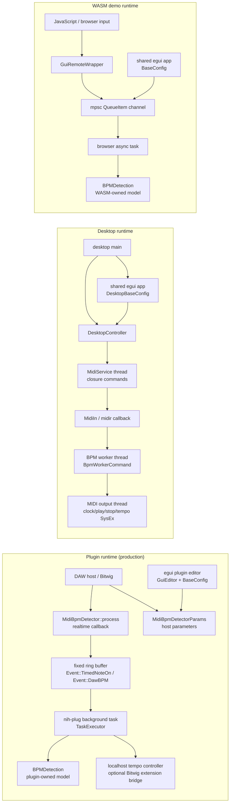

Shared connections from the runtime row:

- `GuiRemote`: updated by plugin tasks, plugin editor setup, desktop bootstrap, native BPM worker, and the WASM async
  task.
- `bpm_detection_core`: used by each runtime-owned `BPMDetection` model and by the shared note/config types.
- `gui`: used by each runtime's GUI-facing config object and by `GuiRemote` for repaint/update state.

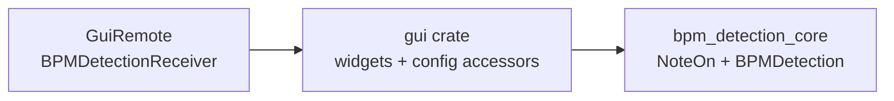

The `gui` crate is deliberately shared and runtime-neutral. Plugin, desktop, and WASM mode each provide a config object
that implements the GUI-facing accessors. Those config objects are where runtime-specific side effects start.

## Plugin Bootstrap

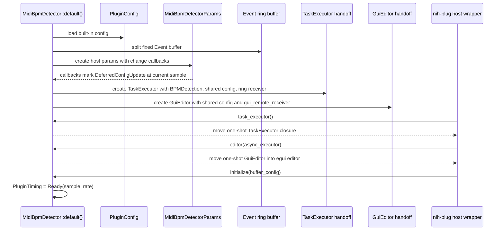

Who knows what:

- `MidiBpmDetector` owns the realtime callback state, host parameters, sample clock, deferred update markers, and the
  realtime-to-background ring producer.
- `TaskExecutor` owns the plugin BPM model, dynamic config snapshot, ring consumer, optional `GuiRemote`, and optional
  tempo-controller TCP connection.
- `GuiEditor` owns the plugin editor lifecycle and creates the GUI app when the editor opens.
- `GuiRemote` is passed by value across the runtime as a receiver/handle, but it only exposes the UI update surface.
- The `task_executor_handoff` and `gui_editor_handoff` fields are one-shot NIH-plug handoff slots, not general nullable
  runtime state.

## Plugin Notes

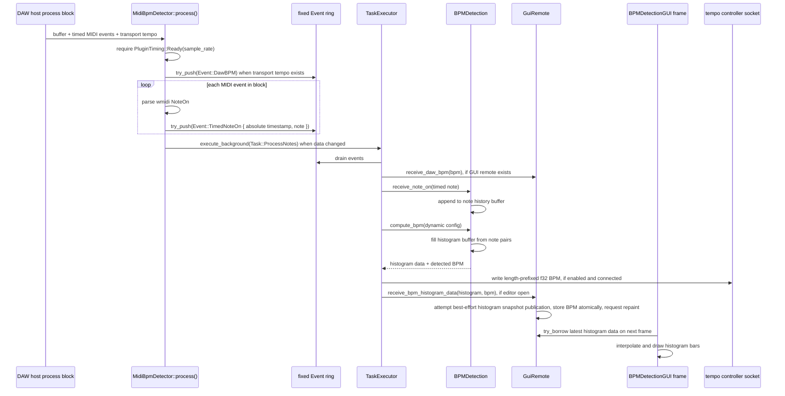

Data that crosses the realtime boundary is intentionally small:

- `Event::TimedNoteOn(TimedNoteOn)` carries the timestamped core note observation.
- `Event::DawBPM(f32)` carries host transport tempo for display.
- `Task::ProcessNotes { force_evaluate_bpm_detection }` tells the background executor when the ring should be drained.

The realtime callback does not own GUI rendering, BPM computation, TCP writes, or host parameter reconciliation.

The histogram path is a latest-state handoff, not a note-by-note GUI queue:

- `BPMDetection::receive_note_on` mutates the model's note/history state.
- `BPMDetection::compute_bpm` clears and refills the model's histogram buffer from accumulated note pairs, returns
  `(histogram_data_points, detected_bpm)`, and prunes old notes after choosing a BPM.
- `GuiRemote::receive_bpm_histogram_data` copies the complete histogram into producer-owned reusable scratch, tries to
  swap it into the GUI-facing snapshot, stores the detected BPM in an atomic, and requests a repaint.
- `BPMDetectionGUI` tries to borrow the latest histogram data during a frame, interpolates from the previous drawn data,
  and renders the bars.

That boundary is useful because BPM producers do not wait for egui to draw. If the GUI is borrowing the snapshot when a
producer publishes, that visualization update is logged and dropped without retry while scalar BPM publication remains
independent. If the GUI cannot borrow the snapshot while drawing, that frame is skipped. This favors realtime/background
progress and responsive rendering over preserving every visual update.

Desktop and WASM use the same `GuiRemote` receiver shape after their worker/task computes a histogram.

## Plugin Parameter Changes From The Host

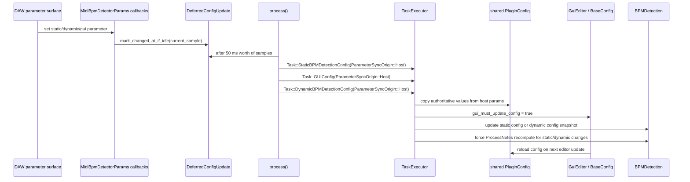

The host parameter surface is authoritative for host-origin parameter sync. The GUI refreshes from shared config instead
of echoing the same edit back to the host as a new user action.

## Plugin Parameter Changes From The GUI

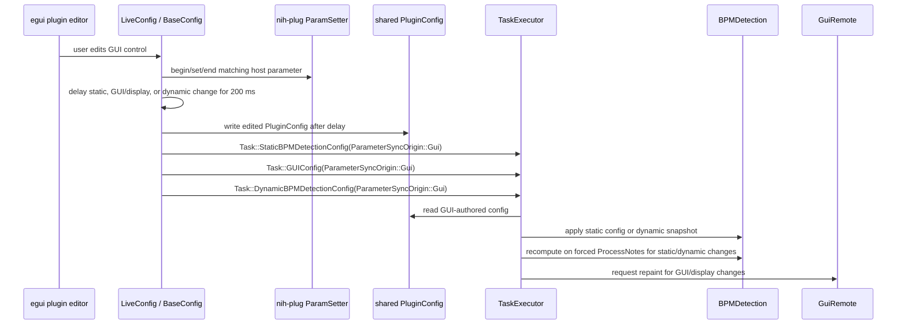

The GUI-origin path intentionally writes host parameters through `ParamSetter`, because the DAW surface must reflect the
editor change. The GUI-origin parameter sync tasks then let the background BPM model consume the already-shared config
without treating the host callback as the source of truth.

The plugin code names the origin with `ParameterSyncOrigin::Host` or `ParameterSyncOrigin::Gui`; the consequences are
fixed:

| Origin | Authoritative surface | Coalescing window | GUI refresh | Host refresh | BPM recompute |
| --- | --- | --- | --- | --- | --- |
| Host/DAW | host parameters | 50 ms on the host sample clock | reload from shared config | already current | immediate worker task for static/dynamic changes |
| GUI | shared GUI-authored config | 200 ms on the editor wall clock | already current | `ParamSetter` write-through before the worker task | next realtime `process()` block for static/dynamic changes |

This table documents behavior, not optional capabilities. It is useful because the worker receives both host-origin and
GUI-origin config tasks. At origin-specific call sites, keep known facts direct: the host path uses the host coalescing
window, the GUI path uses the GUI coalescing window, static and dynamic changes mark BPM detection for re-evaluation, and
GUI/display changes repaint without forcing a BPM recompute.

## Plugin GUI Open And Close

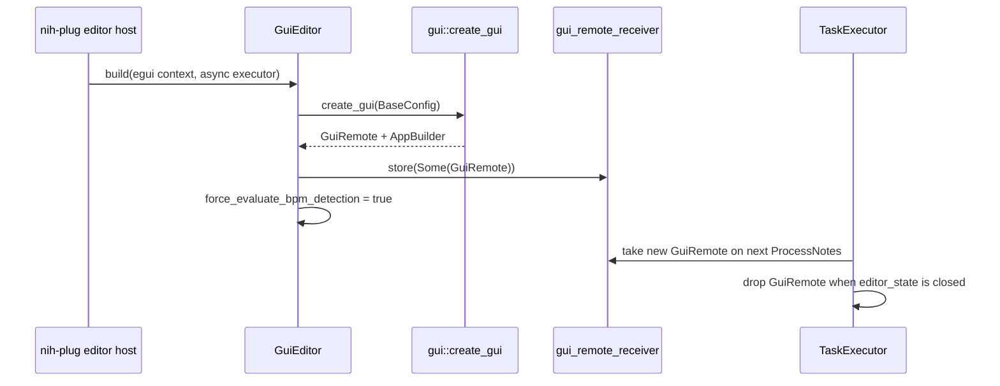

This is why `GuiRemote` is not constructed directly inside the background executor. The GUI runtime owns the actual egui
context; the background task only picks up a remote handle after the editor has been built.

## Desktop Bootstrap

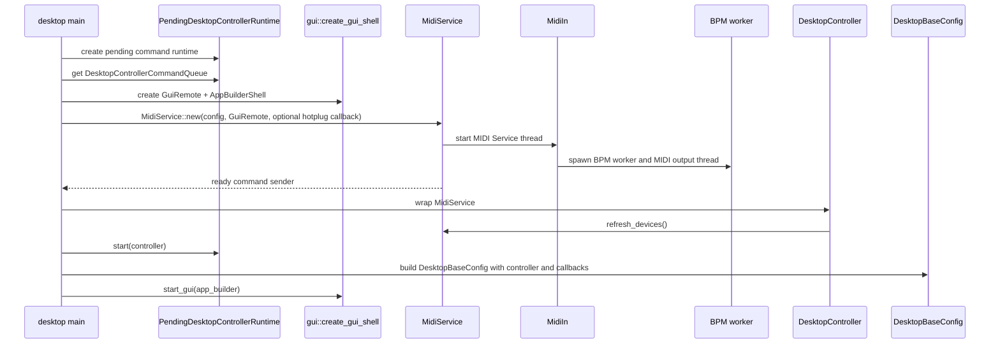

Desktop startup is the clearest example of "glue at startup, peers after that." `main` wires the GUI, controller,
command queue, service thread, worker, and output thread. After bootstrap:

- the GUI does not know `MidiIn` or `midir`;
- `bpm_detection_midi` does not know egui;
- the desktop controller is the one native bridge between those dependency surfaces;
- queued controller commands are closures targeted at `DesktopController`, not a desktop-wide action enum.

## Desktop MIDI Notes

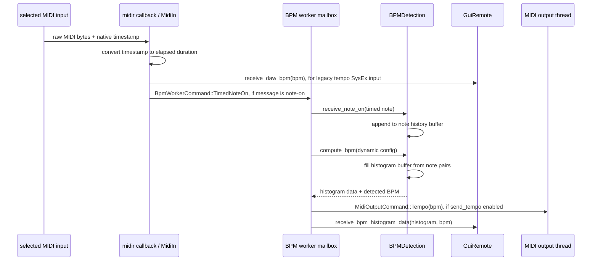

`BpmWorkerCommand` filters the native MIDI stream before it reaches the BPM worker. High-volume messages such as MIDI
Timing Clock do not wake the worker unless the worker owns a reason to act on them.

## Desktop User Actions

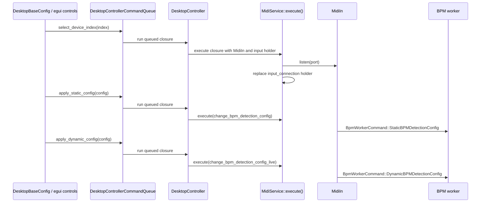

The GUI can display and request native operations, but it does not directly hold the MIDI input connection or worker
sender. The selected input lifetime is controlled by the service thread's `Option<MidiInputConnection<()>>`; replacing or
dropping that holder starts or stops listening.

## WASM Demo Flow

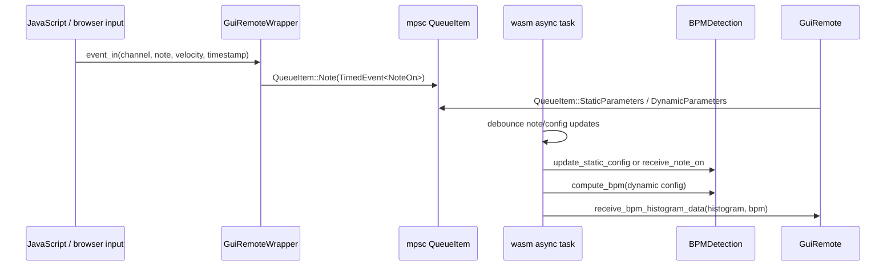

WASM follows the same conceptual pipeline, but browser constraints replace native threads with async tasks and bounded
channels. It is useful for demos and model/UI iteration, not the production constraint.
