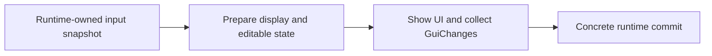
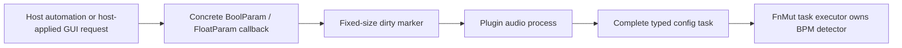
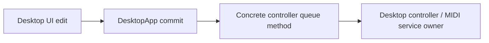
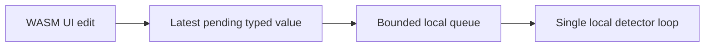

# Runtime Lifecycle

This document owns the cross-runtime phase and ownership diagrams for the plugin, desktop application, and WASM demo.
The Rust crate map lives in [Rust workspace architecture](../rust/architecture.md); mode-specific detail lives in
[plugin flow](plugin-flow.md) and [native MIDI flow](native-midi-flow.md).

## Shared GUI Phase

Each runtime owns the editable values presented to the shared UI and the effects that follow an edit. The common phase is:

```mermaid
flowchart LR
    I["Runtime-owned input snapshot"] --> P["Prepare display and editable state"]
    P --> S["Show UI and collect GuiChanges"]
    S --> C["Concrete runtime commit"]
```

`BPMDetectionGUI::prepare` snapshots the latest estimated and DAW BPM values for the next render. The runtime supplies an
`EditableSettings` proposal to `BPMDetectionGUI::show`; `show` renders and edits that value, then returns `GuiChanges`.
The receipt has four independent booleans: `gui`, `static_detection`, `dynamic_detection`, and `send_tempo`.

Shared rendering has no host parameter handle, runtime sender, desktop controller, persistence owner, or callback for
runtime effects. The adapter interprets the receipt after rendering:

- `DesktopApp` and `WasmApp` call `prepare` from eframe `App::logic`, then call `show` and commit from `App::ui`.
- `PluginGuiEditor` invokes the same methods explicitly around the `&mut egui::Ui` supplied by nice-plug.

## Shared Display Capabilities

`create_gui` creates one `DisplayState`. `BPMDetectionGUI` holds its strong `Arc` and therefore owns the lifetime of the
latest display mailbox. The two producer-side capabilities hold weak references:

- `BpmDisplayPublisher` implements `BPMDetectionReceiver`. It atomically publishes scalar BPM values and attempts to
  swap a complete histogram snapshot from reusable producer scratch into the mailbox. A busy scratch buffer or display
  snapshot drops that histogram update rather than blocking. A dropped GUI turns every publication into a no-op.
- `GuiContextHandle` only requests repaint and reports whether egui wants keyboard input. A busy or dropped context also
  produces a no-op rather than blocking.

`BPMDetectionGUI` reuses its interpolation buffer across frames. A producer reuses its histogram scratch allocation, and
`BPMDetection` clears and refills its owned histogram buffer during computation. The handoff carries latest display state,
not an ordered history of visual updates.

## Plugin Runtime

The plugin's parameter-backed configuration moves through CLAP parameters and the audio-block boundary:

```mermaid
flowchart LR
    H["Host automation or host-applied GUI request"] --> P["Concrete BoolParam / FloatParam callback"]
    P --> D["Fixed-size dirty marker"]
    D --> A["Plugin audio process"]
    A --> T["Complete typed config task"]
    T --> E["FnMut task executor owns BPM detector"]
```

### Parameter and editor phases

`MidiBpmDetectorParams` holds the committed host parameters. Each `OnOff<f32>` field appears as an adjacent, visible,
automatable Boolean enable parameter and numeric parameter rather than an adapter-owned persisted bit or arbitrary
sidecar field. Both concrete parameter callbacks use the same logical group's `DeferredConfigUpdate`; either callback
records the current sample when that marker is idle. The send-tempo and controller-port parameters update their focused
atomic outputs directly.

`PluginGuiEditor` retains a draft plus the previous host snapshot. Each editor update:

1. reads the current host values;
2. merges host changes into the draft field by field, replacing only fields whose host value changed since the previous
   snapshot;
3. applies the plugin-only `T` shortcut to the draft when pressed;
4. calls `BPMDetectionGUI::prepare` and `BPMDetectionGUI::show` with nice-plug's supplied UI;
5. issues normal `ParamSetter` begin/set/end requests for only the changed enable and/or numeric half of an `OnOff`
   proposal.

The `T` shortcut sets the same `GuiChanges::send_tempo` receipt as the visible toggle, so both use the same
begin/set/end parameter gesture. Generated `MirrorChangedConfig` implementations compare fields within each edited group
and issue setter calls only for fields whose draft values changed. A setter call is only a GUI request: `previous_host`
advances from committed host readback, and the concrete parameter callback follows host application. The callback then
enters the same deferred audio-block path as host automation.

### Audio-block commit

`MidiBpmDetector::process` uses the sample clock to coalesce each dirty group for 50 ms. At the boundary it reads the
committed static or dynamic host values where needed and schedules one of these concrete tasks:

- `Task::ApplyStaticConfig(StaticBPMDetectionConfig)`;
- `Task::ApplyDynamicConfig(DynamicBPMDetectionConfig)`;
- `Task::RefreshGui`.

The task enum and its configuration payloads have fixed value shapes. The process callback also converts the finite MIDI
events in the current host block into `Event::TimedNoteOn` values, publishes DAW tempo as `Event::DawBPM`, and uses
`try_push` on a fixed ring buffer. It schedules `Task::ProcessNotes` when new input or an editor-open recomputation request
exists.

The mutable nice-plug task-executor closure owns one concrete `TaskExecutor`. Its `DetectionRuntime` exclusively owns
`BPMDetection`, the dynamic configuration snapshot, and the event-ring consumer. Detector updates, histogram computation,
TCP tempo feedback, and display publication all run there rather than in `process`.

Editor opening creates a fresh GUI and places `(BpmDisplayPublisher, GuiContextHandle)` in a one-slot handoff. The task
executor adopts that pair on its next task and drops its live weak handles after the host closes the editor.

## Desktop Runtime

Desktop edits cross an explicit controller boundary:

```mermaid
flowchart LR
    U["Desktop UI edit"] --> C["DesktopApp commit"]
    C --> Q["Concrete controller queue method"]
    Q --> R["Desktop controller / MIDI service owner"]
```

`DesktopApp` owns `DesktopConfig`, its `EditableSettings` proposal, and a GUI-local `DeviceSelection` snapshot. In
`App::logic`, it prepares shared display values and attempts a nonblocking controller lock. The complete device-selection
snapshot is cloned only when the controller's revision differs from `displayed_revision`; a busy controller leaves the
last snapshot visible for that frame.

`App::ui` renders desktop device controls and calls `BPMDetectionGUI::show`. `DesktopApp::commit` copies edited values
into its in-memory `DesktopConfig` and invokes the corresponding concrete `DesktopControllerCommandQueue` method:
`apply_static_config`, `apply_dynamic_config`, `set_send_tempo`, `refresh_devices`, or `select_device_index`. The queue's
generic closure transport is private to the desktop runtime.

The controller translates those commands into `MidiService::execute` closures or the focused send-tempo setter. The MIDI
service thread owns `MidiIn` and the selected `MidiInputConnection`; the BPM worker owns `BPMDetection`; the MIDI-output
thread serializes clock, play/stop, and tempo messages. [Native MIDI flow](native-midi-flow.md) describes those boundaries
in detail.

## WASM Runtime

WASM uses a bounded local channel and one async detector owner:

```mermaid
flowchart LR
    U["WASM UI edit"] --> P["Latest pending typed value"]
    P --> Q["Bounded local queue"]
    Q --> L["Single local detector loop"]
```

`WasmApp` owns `EditableSettings` and `PendingGuiCommits`. `App::ui` records the latest edited static and dynamic values
in separate `Option` slots, then makes one `try_send` attempt per slot. `App::logic` prepares display values and retries
any retained slots. A full channel restores the attempted typed value and requests another frame after 16 ms; a newer GUI
edit replaces the unsent value of the same type. A successful send or a closed channel clears that slot.

The channel has capacity 100. Values already accepted into it remain ordered; latest-value replacement applies only to
the two GUI-side pending slots.

One spawned local task owns `BPMDetection`, `pending_static`, `pending_dynamic`, `notes_changed`, and the receive loop.
Incoming configuration messages replace the corresponding local pending value. Delayed tasks carry only a
`DelayedStaticUpdate` or `DelayedDynamicUpdate` wake message; when the loop receives one, it consumes the owned pending
value. Notes mutate the same locally owned detector. This keeps detector coalescing state out of shared atomics or
borrowed cells.

Browser input reaches the loop through `GuiRemoteWrapper`, which contains only a `GuiContextHandle` for keyboard-focus
inspection and a channel sender for typed note events. It does not expose shared rendering state or runtime commit
callbacks.
