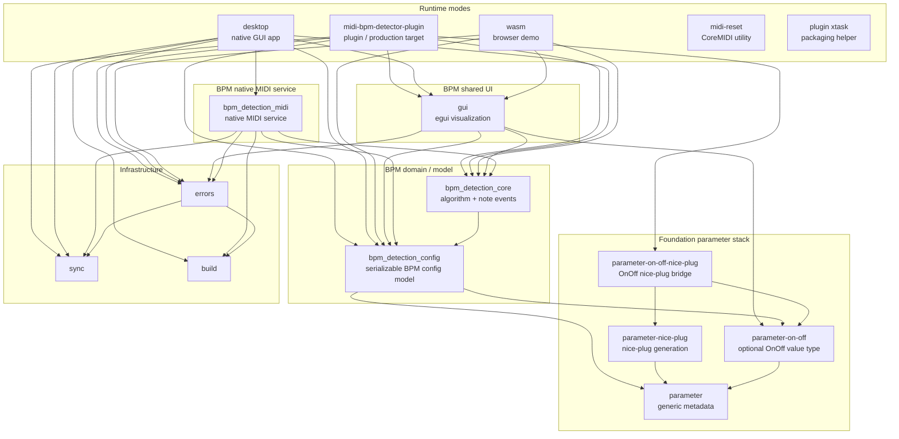

# Rust Workspace Architecture

This document owns Rust-specific architecture detail for the `rust/` build root: local crate grouping, workspace
dependency direction, runtime entrypoints, realtime constraints, and parameter-stack boundaries. The repository-level
architecture page in `../docs/architecture.md` stays focused on cross-build-root shape and links here for crate-level
detail.

## Workspace Shape

The Rust workspace supports three application modes plus supporting crates:

- `plugin`: the CLAP/VST3 plugin intended to run inside a DAW. This is the production target.
- `desktop`: a native GUI development app.
- `wasm`: a browser demo using the shared egui UI.

The main dependency rule is that runtime modes own their host/runtime integration, while shared crates carry the BPM
algorithm, reusable UI, reusable parameter metadata, and small cross-platform support types.

## Crate Map

The graph below shows direct workspace crate dependencies. It intentionally omits third-party crates so the local
architecture remains readable. Arrows point from the crate that imports a dependency to the crate it depends on.



This graph captures the workspace dependency rule: `bpm_detection_config` and
`bpm_detection_core` are BPM domain/model crates, while `gui` and `bpm_detection_midi` are separate BPM-specific UI and
native MIDI service crates. `gui` does not depend on native MIDI, and `bpm_detection_midi` does not depend on egui. The
`desktop` crate sits above both because it is the native desktop runtime that wires them together.

## Crate Groups

### BPM Domain / Model

- `crates/bpm/domain/bpm_detection_config`
  - Owns the shared serializable BPM application settings used by plugin, desktop, and WASM runtime configs.
  - Defines `GUIConfig`, `StaticBPMDetectionConfig`, `DynamicBPMDetectionConfig`, `NormalDistributionConfig`, the BPM
    conversion helpers, and the shared `Settings` wrapper around GUI, static BPM detection, and dynamic BPM detection
    config.
  - Owns generated config owner/accessor traits for the serializable parameter groups, plus shared `SettingsOwner`
    delegation for non-plugin runtime configs.
  - Keeps the config data shape below runtime entrypoints without making `gui` the owner of application config.

- `crates/bpm/domain/bpm_detection_core`
  - Owns the BPM detection algorithm.
  - Defines the in-house note event shape consumed by the algorithm and runtime BPM detection state.
  - Depends on `bpm_detection_config` for the serializable static/dynamic BPM detection config and BPM conversion
    helpers.
  - Does not depend on native MIDI runtimes or a MIDI protocol parser.
  - Exposes `BPMDetectionReceiver`, the callback boundary used to publish detected BPM and histogram data.

### Shared Infrastructure

- `crates/support/sync`
  - Provides synchronization aliases/wrappers that differ by target.
  - Keeps platform-specific lock/atomic choices out of higher-level crates.

- `crates/support/errors`
  - Centralizes error reporting, logging, panic handling, and tracing helpers.

- `crates/support/build`
  - Provides build metadata and project directories shared by multiple binaries/crates.

### BPM Shared UI

- `crates/bpm/gui`
  - Owns the reusable egui UI for parameters, BPM legend, and histogram rendering.
  - `BPMDetectionGUI` owns view state and the strong reference to the latest display mailbox.
  - `BpmDisplayPublisher` is a weak producer capability that publishes BPM and histogram snapshots without keeping a
    closed GUI alive. Histogram publication is best-effort: contention drops that visualization update, while scalar BPM
    publication remains independent.
  - `GuiContextHandle` is a separate weak capability for requesting repaint and inspecting whether egui wants keyboard
    input.
  - `EditableSettings` is a runtime adapter's local proposal value. `GuiChanges` reports whether the GUI, static
    detection, dynamic detection, or send-tempo group was edited during one call to `BPMDetectionGUI::show`.
  - Depends on `bpm_detection_config` for GUI parameter metadata and editable value types, but does not own a runtime's
    serialized config, host parameters, controller, queue, or persistence effects.

### Runtime Entrypoints

- `crates/entrypoints/midi-bpm-detector-plugin`
  - CLAP/VST3 integration via `nice-plug`.
  - Receives MIDI in the plugin `process` callback.
  - Parses host MIDI bytes at the plugin boundary and maps note-on events into the core note type.
  - Uses a fixed ring buffer and host background tasks so the realtime callback avoids expensive work.
  - Owns DAW/plugin parameter integration and optional tempo feedback to the Bitwig controller socket.

- `crates/entrypoints/desktop`
  - Native desktop GUI app.
  - Connects the shared GUI to the native MIDI runtime through a desktop controller boundary.
  - Uses `bpm_detection_midi::MidiService` for native MIDI service behavior.
  - Reuses the shared `gui` crate for visualization and configuration.

- `crates/entrypoints/wasm`
  - Browser demo wrapper.
  - Uses Trunk, wasm-bindgen, browser MIDI/keyboard input, and the shared egui UI.
  - Uses async browser tasks and bounded channels instead of native threads.

- `crates/entrypoints/midi-bpm-detector-plugin/xtask`
  - Packaging helper for plugin bundles.

### Native Tools

- `crates/tools/midi-reset`
  - Small macOS utility for restarting CoreMIDI.
  - Kept separate from the main operating modes.

### BPM Native MIDI Service

- `crates/bpm/native-midi/bpm_detection_midi`
  - Native MIDI runtime used by the desktop mode.
  - Owns MIDI device discovery/input, virtual MIDI output, SysEx control messages, playback clock emission, and the
    worker threads around `BPMDetection`.
  - Remains outside plugin and WASM builds, leaving those modes without native MIDI service dependencies.

## Foundation Parameter Stack

- `crates/foundation/parameter`
  - Defines generic parameter metadata, value conversion helpers, and the `#[parameter_group]` macro.
  - Keeps parameter descriptions reusable across GUI, plugin, core config, and other plugin products.

- `crates/foundation/parameter-nice-plug`
  - Owns reusable nice-plug host parameter generation and mirroring for generic parameter metadata.
  - Provides the `NicePlugFieldAdapter` and `MirrorHostParams` extension points used by optional bridge crates. A field
    adapter owns a host-parameter set, which may contain one concrete parameter or several.

- `crates/foundation/parameter-on-off`
  - Owns the reusable `OnOff<T>` value type and its serialization/value conversion behavior.
  - Has no nice-plug dependency.

- `crates/foundation/parameter-on-off-nice-plug`
  - Bridges one `OnOff<f32>` config field into an adjacent Boolean enable and numeric value pair through `OnOffParams`
    and `OnOffF32Adapter`, without requiring another config field.
  - Depends on the base parameter crates, not on BPM product crates.

Product, domain, and application crates depend down into this foundation stack. Foundation crates have no dependencies
back up into BPM-specific crates such as `midi-bpm-detector-plugin`, `bpm_detection_core`, `bpm_detection_midi`, or `gui`.
This grouping supports the production plugin first while keeping desktop and WASM as development/demo consumers of the
same generic metadata.

## Operating Mode Boundaries

The same conceptual pipeline appears in each mode:

```text
MIDI/key input -> runtime-specific parsing -> core note events -> BPMDetection -> histogram/BPM output
    -> UI and/or host integration
```

The important difference is where that pipeline is allowed to do work:

- In plugin mode, the audio/plugin callback is the constrained boundary. Project-side work there uses fixed-size values
  and nonblocking handoffs; BPM computation runs in the background executor.
- In desktop mode, MIDI and BPM work can live in native worker threads. The desktop controller bridges
  `bpm_detection_midi` into the native GUI app without moving MIDI dependencies into `gui`.
- WASM mode has no native worker threads. Browser events and delayed recomputation are coordinated through async tasks
  and channels.

## Shared GUI Phase Contract

All three runtime adapters use the same phase contract around the shared egui surface:

```text
runtime-owned input snapshot
    -> BPMDetectionGUI::prepare display state
    -> BPMDetectionGUI::show editable state and collect GuiChanges
    -> concrete runtime-owned commit
```

`DesktopApp` and `WasmApp` call `prepare` from eframe `App::logic`, then call `show` and commit from `App::ui`.
`PluginGuiEditor` performs the equivalent sequence explicitly around the `&mut egui::Ui` supplied by nice-plug. Shared
rendering only changes the supplied proposal value and returns the four-boolean receipt; the runtime adapter owns every
host parameter request, controller command, queue send, and persisted value update.

## Desktop Mode

Desktop mode integrates the reusable GUI with the native MIDI service. The desktop controller exposes typed capabilities
for native MIDI service actions rather than a runtime-wide event enum.

Current boundary notes:

- `bpm_detection_midi::MidiService`'s closure-command surface, where callers submit a closure that runs on the MIDI
  service thread. This matches the preferred peer-boundary direction: the service owns its synchronization ceremony, and
  callers use the narrow capability they need.
- Device-selection behavior that keeps the same selected device when the device list is refreshed, reordered, or
  temporarily loses an entry.
- Typed startup/lifecycle boundaries in the desktop bootstrap and command runtime.
- Small worker-owned message enums such as `BpmWorkerCommand`. These are narrow protocols for one worker boundary, not a
  general application bus.

## Realtime Constraints

The plugin crate is the production runtime and has the strictest execution constraints. The code reflects these
constraints:

- The plugin `process` callback parses incoming MIDI and pushes events with `try_push` into a fixed ring buffer.
- BPM computation runs from `nice-plug` background tasks, not directly from the audio callback.
- Cross-thread state crossing the callback boundary uses atomics, fixed buffers, or non-blocking handoff.
- Display updates go through `BpmDisplayPublisher`; repaint and keyboard-focus inspection use the separate
  `GuiContextHandle`. The audio callback owns neither GUI state nor rendering work.

These constraints define the plugin-mode execution boundary. Project-owned allocation, blocking I/O, lock contention,
and self-driven unbounded work remain outside the realtime callback; its only event loop drains the finite host block.
Fixed-capacity buffers in plugin and core runtime paths are part of this contract, and test harnesses accommodate their
stack requirements without changing production storage.

## Plugin Dependency Notes

The plugin path uses the personal `valsteen/nice-plug` fork and consumes `egui-baseview` 0.6.0 from crates.io. The
nice-plug fork carries two downstream patches shared by several plugins:

- mutable background task executors for plugins whose executor owns state;
- an `UnsupportedMidi` escape hatch that preserves sample-accurate three-byte control data routed through a host's normal
  MIDI/device graph.

Plugin tempo feedback uses the localhost controller bridge described in [plugin flow](../docs/plugin-flow.md).

The nice-plug fork follows a forward-only policy:

- newer upstream dependency generations take precedence over patches to stale transitive crates;
- fork diffs remain small and shaped like upstreamable compatibility work;
- pinned commits keep plugin builds reproducible;
- periodic upstream comparison identifies patches that can be dropped or reduced.

The dependency rule is forward movement over patching obsolete transitive crates. Fork changes remain limited to
downstream plugin behavior that upstream nice-plug does not provide.

## Configuration Shape

The BPM model has two broad config groups:

- Static BPM detection config: changes that alter the detection model shape, such as BPM range, sample rate, and normal
  distribution settings.
- Dynamic BPM detection config: changes that affect scoring/evaluation weights while the model is running.

Each runtime mode adapts this shared config into its own host surface:

- plugin parameters in `midi-bpm-detector-plugin`;
- `DesktopConfig` plus `DesktopControllerCommandQueue` in `desktop`;
- `WASMConfig` plus the local `QueueItem` channel in `wasm`.

### Plugin Parameter Synchronization

`MidiBpmDetectorParams` holds the plugin's committed CLAP parameters. Each `NicePlugFieldAdapter` represents an adapted
config field with a host-parameter set; `OnOffF32Adapter` uses `OnOffParams` to expose one `OnOff<f32>` field as a
visible, automatable `BoolParam` followed by its `FloatParam`. The adapter has no separate persisted enable bit or
arbitrary sidecar field. Both concrete callbacks share the field group's change notification and therefore independently
reach the normal deferred audio-boundary path.

The editor retains a local `EditableSettings` draft and compares two consecutive host snapshots field by field. A host
field that changed replaces the corresponding draft field; an unchanged host field leaves an unacknowledged editor
proposal intact.

After `BPMDetectionGUI::show`, `PluginGuiEditor` maps only edited groups and changed host-parameter fields through
nice-plug's `ParamSetter`. It sends normal begin/set/end requests only for the changed enable and/or numeric half of an
`OnOff` proposal. Those calls do not mutate committed host values: committed readback and the corresponding parameter
callbacks follow host application. The callbacks mark fixed-size dirty groups at the current sample, and
`MidiBpmDetector::process` coalesces them on the sample clock before sending complete typed
`Task::ApplyStaticConfig` or `Task::ApplyDynamicConfig` payloads, or `Task::RefreshGui` work. The mutable nice-plug task
executor exclusively owns `BPMDetection`.

The exact plugin, desktop, and WASM sequences live in [runtime lifecycle](../docs/runtime-lifecycle.md). Parameter
readback and editor requests are detailed in [plugin flow](../docs/plugin-flow.md).

## Stable Architecture Invariants

- `bpm_detection_config` owns serializable parameter/config values, `bpm_detection_core` owns the algorithm and core
  note surface, and `bpm_detection_midi` owns native MIDI service integration.
- `BPMDetectionGUI` renders runtime-owned editable values. Runtime adapters own commit effects.
- `BpmDisplayPublisher` and `GuiContextHandle` are focused weak capabilities, not a broad GUI remote.
- Plugin mode is the production target and defines the strict realtime constraints. Desktop and WASM use the same model
  through runtime-appropriate commit paths.
- Typed peer boundaries are wired during bootstrap; worker-local enums and queues remain scoped to one owner rather than
  forming a runtime-wide event bus.
- [Runtime lifecycle](../docs/runtime-lifecycle.md) owns the detailed data-flow and thread-boundary diagrams.
